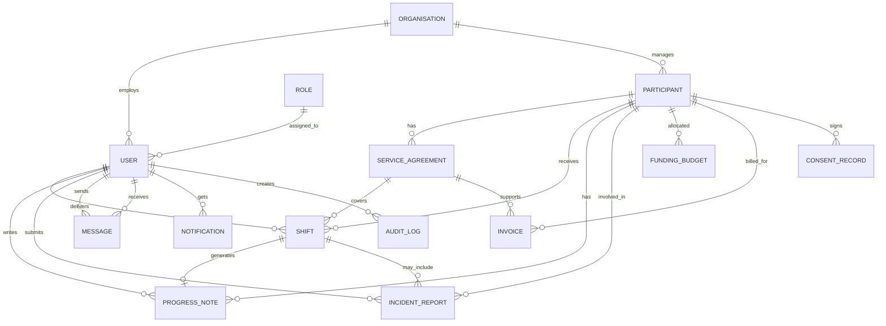
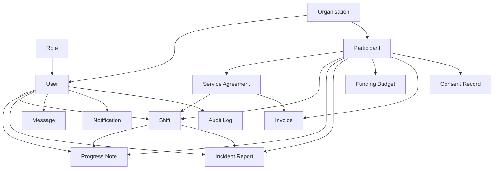
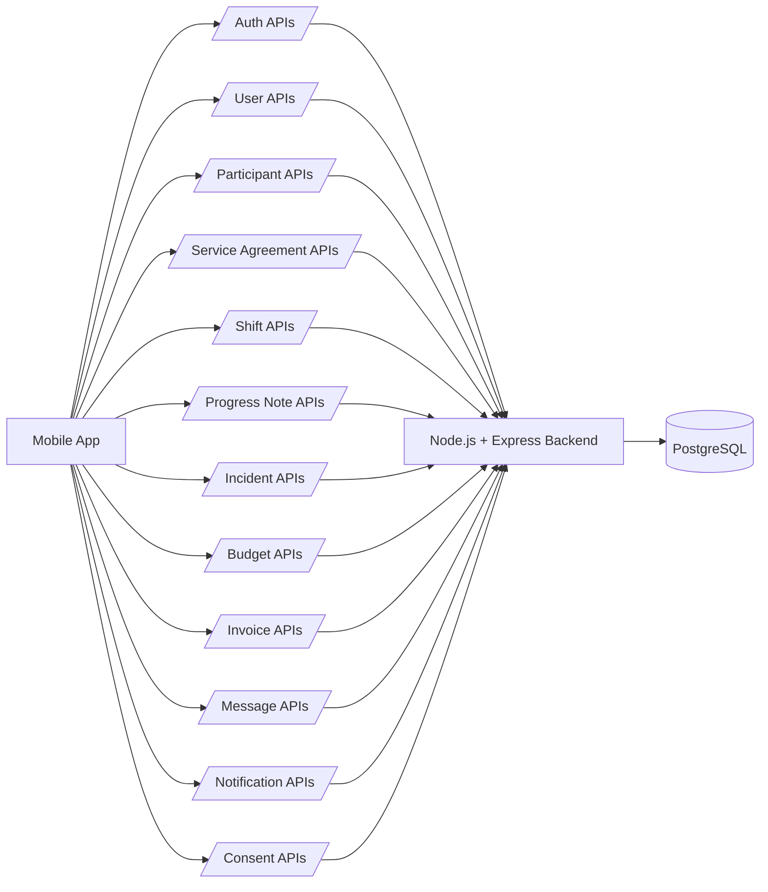
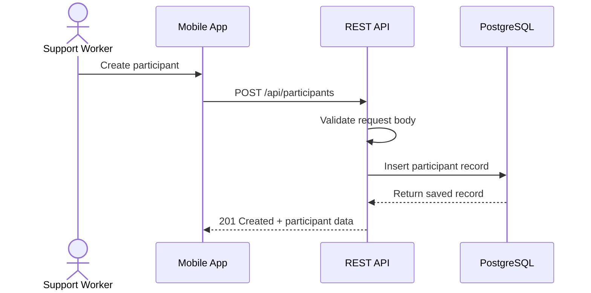

# Week 5 – Database Schema and API Specification

## Project Title
**NDIS Provider Support Mobile Application (Sydney)**

---

## 1. Introduction

This document presents the **data model and API specification** for the NDIS Provider Support Mobile Application (Sydney). It defines the core database entities, relationships between those entities, REST API endpoints, validation rules, and supporting diagrams required to implement the main system features.

The purpose of this deliverable is to provide a clear technical design for how the application will store, manage, and exchange data across the frontend, backend, and database layers.

---

## 2. Objectives of This Deliverable

This deliverable aims to:

- identify the main entities in the system
- define the relationships between those entities
- design the database schema structure
- define REST APIs required by the system
- establish validation rules for secure and accurate data entry
- include diagrams that visually explain the schema and API flow

---

## 3. Core Entities

The following entities exist in the system:

1. **Organisation**
2. **User**
3. **Role**
4. **Participant**
5. **ServiceAgreement**
6. **Shift**
7. **ProgressNote**
8. **IncidentReport**
9. **Invoice**
10. **FundingBudget**
11. **Message**
12. **Notification**
13. **AuditLog**
14. **ConsentRecord**

---

## 4. Entity Descriptions

### 4.1 Organisation
Represents an NDIS provider organisation using the system.

**Attributes:**
- organisation_id (PK)
- organisation_name
- abn
- address
- phone
- email
- created_at
- updated_at

### 4.2 Role
Represents user access levels in the system.

**Attributes:**
- role_id (PK)
- role_name
- description

### 4.3 User
Represents staff members such as administrators, support workers, and coordinators.

**Attributes:**
- user_id (PK)
- organisation_id (FK)
- role_id (FK)
- first_name
- last_name
- email
- phone
- password_hash
- status
- created_at
- updated_at

### 4.4 Participant
Represents an NDIS client receiving services.

**Attributes:**
- participant_id (PK)
- organisation_id (FK)
- first_name
- last_name
- date_of_birth
- gender
- ndis_number
- address
- phone
- emergency_contact_name
- emergency_contact_phone
- support_needs
- status
- created_at
- updated_at

### 4.5 ServiceAgreement
Represents a formal agreement for services delivered to a participant.

**Attributes:**
- agreement_id (PK)
- participant_id (FK)
- organisation_id (FK)
- start_date
- end_date
- service_type
- hourly_rate
- agreement_status
- created_at
- updated_at

### 4.6 Shift
Represents scheduled support services or appointments.

**Attributes:**
- shift_id (PK)
- participant_id (FK)
- user_id (FK)
- agreement_id (FK)
- shift_date
- start_time
- end_time
- location
- shift_status
- notes
- created_at
- updated_at

### 4.7 ProgressNote
Represents care or service notes created after a shift.

**Attributes:**
- note_id (PK)
- shift_id (FK)
- participant_id (FK)
- user_id (FK)
- note_text
- created_at
- updated_at

### 4.8 IncidentReport
Represents incidents that occur during service delivery.

**Attributes:**
- incident_id (PK)
- participant_id (FK)
- user_id (FK)
- shift_id (FK, optional)
- incident_type
- description
- severity
- action_taken
- reported_at
- created_at
- updated_at

### 4.9 FundingBudget
Represents participant funding allocation and usage.

**Attributes:**
- budget_id (PK)
- participant_id (FK)
- total_budget
- used_budget
- remaining_budget
- budget_period_start
- budget_period_end
- updated_at

### 4.10 Invoice
Represents billing records for services delivered.

**Attributes:**
- invoice_id (PK)
- participant_id (FK)
- agreement_id (FK)
- invoice_number
- issue_date
- due_date
- amount
- invoice_status
- created_at
- updated_at

### 4.11 Message
Represents secure communication between users.

**Attributes:**
- message_id (PK)
- sender_id (FK)
- receiver_id (FK)
- participant_id (FK, optional)
- message_text
- sent_at
- is_read

### 4.12 Notification
Represents system-generated reminders and alerts.

**Attributes:**
- notification_id (PK)
- user_id (FK)
- title
- message
- notification_type
- is_read
- created_at

### 4.13 AuditLog
Tracks important actions for security and compliance.

**Attributes:**
- audit_id (PK)
- user_id (FK)
- action_type
- entity_name
- entity_id
- action_details
- created_at

### 4.14 ConsentRecord
Represents participant consent for data handling or services.

**Attributes:**
- consent_id (PK)
- participant_id (FK)
- consent_type
- consent_status
- signed_date
- expiry_date
- document_url
- created_at
- updated_at

---

## 5. Entity Relationships

The following relationships exist in the database:

- One **Organisation** has many **Users**
- One **Organisation** has many **Participants**
- One **Role** has many **Users**
- One **Participant** has many **ServiceAgreements**
- One **Participant** has many **Shifts**
- One **User** can manage many **Shifts**
- One **Shift** can have one **ProgressNote**
- One **Participant** can have many **ProgressNotes**
- One **Participant** can have many **IncidentReports**
- One **Participant** can have one or more **FundingBudgets**
- One **Participant** can have many **Invoices**
- One **User** can send and receive many **Messages**
- One **User** can receive many **Notifications**
- One **User** can create many **AuditLogs**
- One **Participant** can have many **ConsentRecords**

---

## 6. Conceptual ER Diagram



---

## 7. High-Level Data Model Diagram



---

## 8. Suggested Relational Schema

### Organisation
- organisation_id UUID PRIMARY KEY
- organisation_name VARCHAR(150) NOT NULL
- abn VARCHAR(20) UNIQUE
- address TEXT
- phone VARCHAR(20)
- email VARCHAR(120) UNIQUE
- created_at TIMESTAMP NOT NULL
- updated_at TIMESTAMP NOT NULL

### Role
- role_id UUID PRIMARY KEY
- role_name VARCHAR(50) UNIQUE NOT NULL
- description TEXT

### User
- user_id UUID PRIMARY KEY
- organisation_id UUID NOT NULL REFERENCES Organisation(organisation_id)
- role_id UUID NOT NULL REFERENCES Role(role_id)
- first_name VARCHAR(80) NOT NULL
- last_name VARCHAR(80) NOT NULL
- email VARCHAR(120) UNIQUE NOT NULL
- phone VARCHAR(20)
- password_hash TEXT NOT NULL
- status VARCHAR(20) NOT NULL
- created_at TIMESTAMP NOT NULL
- updated_at TIMESTAMP NOT NULL

### Participant
- participant_id UUID PRIMARY KEY
- organisation_id UUID NOT NULL REFERENCES Organisation(organisation_id)
- first_name VARCHAR(80) NOT NULL
- last_name VARCHAR(80) NOT NULL
- date_of_birth DATE
- gender VARCHAR(20)
- ndis_number VARCHAR(30) UNIQUE NOT NULL
- address TEXT
- phone VARCHAR(20)
- emergency_contact_name VARCHAR(120)
- emergency_contact_phone VARCHAR(20)
- support_needs TEXT
- status VARCHAR(20) NOT NULL
- created_at TIMESTAMP NOT NULL
- updated_at TIMESTAMP NOT NULL

### ServiceAgreement
- agreement_id UUID PRIMARY KEY
- participant_id UUID NOT NULL REFERENCES Participant(participant_id)
- organisation_id UUID NOT NULL REFERENCES Organisation(organisation_id)
- start_date DATE NOT NULL
- end_date DATE
- service_type VARCHAR(100) NOT NULL
- hourly_rate DECIMAL(10,2) NOT NULL
- agreement_status VARCHAR(20) NOT NULL
- created_at TIMESTAMP NOT NULL
- updated_at TIMESTAMP NOT NULL

### Shift
- shift_id UUID PRIMARY KEY
- participant_id UUID NOT NULL REFERENCES Participant(participant_id)
- user_id UUID NOT NULL REFERENCES User(user_id)
- agreement_id UUID REFERENCES ServiceAgreement(agreement_id)
- shift_date DATE NOT NULL
- start_time TIMESTAMP NOT NULL
- end_time TIMESTAMP NOT NULL
- location TEXT
- shift_status VARCHAR(20) NOT NULL
- notes TEXT
- created_at TIMESTAMP NOT NULL
- updated_at TIMESTAMP NOT NULL

### ProgressNote
- note_id UUID PRIMARY KEY
- shift_id UUID UNIQUE NOT NULL REFERENCES Shift(shift_id)
- participant_id UUID NOT NULL REFERENCES Participant(participant_id)
- user_id UUID NOT NULL REFERENCES User(user_id)
- note_text TEXT NOT NULL
- created_at TIMESTAMP NOT NULL
- updated_at TIMESTAMP NOT NULL

### IncidentReport
- incident_id UUID PRIMARY KEY
- participant_id UUID NOT NULL REFERENCES Participant(participant_id)
- user_id UUID NOT NULL REFERENCES User(user_id)
- shift_id UUID REFERENCES Shift(shift_id)
- incident_type VARCHAR(50) NOT NULL
- description TEXT NOT NULL
- severity VARCHAR(20) NOT NULL
- action_taken TEXT
- reported_at TIMESTAMP NOT NULL
- created_at TIMESTAMP NOT NULL
- updated_at TIMESTAMP NOT NULL

### FundingBudget
- budget_id UUID PRIMARY KEY
- participant_id UUID NOT NULL REFERENCES Participant(participant_id)
- total_budget DECIMAL(12,2) NOT NULL
- used_budget DECIMAL(12,2) NOT NULL DEFAULT 0
- remaining_budget DECIMAL(12,2) NOT NULL
- budget_period_start DATE NOT NULL
- budget_period_end DATE NOT NULL
- updated_at TIMESTAMP NOT NULL

### Invoice
- invoice_id UUID PRIMARY KEY
- participant_id UUID NOT NULL REFERENCES Participant(participant_id)
- agreement_id UUID REFERENCES ServiceAgreement(agreement_id)
- invoice_number VARCHAR(50) UNIQUE NOT NULL
- issue_date DATE NOT NULL
- due_date DATE NOT NULL
- amount DECIMAL(12,2) NOT NULL
- invoice_status VARCHAR(20) NOT NULL
- created_at TIMESTAMP NOT NULL
- updated_at TIMESTAMP NOT NULL

### Message
- message_id UUID PRIMARY KEY
- sender_id UUID NOT NULL REFERENCES User(user_id)
- receiver_id UUID NOT NULL REFERENCES User(user_id)
- participant_id UUID REFERENCES Participant(participant_id)
- message_text TEXT NOT NULL
- sent_at TIMESTAMP NOT NULL
- is_read BOOLEAN NOT NULL DEFAULT FALSE

### Notification
- notification_id UUID PRIMARY KEY
- user_id UUID NOT NULL REFERENCES User(user_id)
- title VARCHAR(150) NOT NULL
- message TEXT NOT NULL
- notification_type VARCHAR(50) NOT NULL
- is_read BOOLEAN NOT NULL DEFAULT FALSE
- created_at TIMESTAMP NOT NULL

### AuditLog
- audit_id UUID PRIMARY KEY
- user_id UUID NOT NULL REFERENCES User(user_id)
- action_type VARCHAR(50) NOT NULL
- entity_name VARCHAR(50) NOT NULL
- entity_id UUID NOT NULL
- action_details TEXT
- created_at TIMESTAMP NOT NULL

### ConsentRecord
- consent_id UUID PRIMARY KEY
- participant_id UUID NOT NULL REFERENCES Participant(participant_id)
- consent_type VARCHAR(50) NOT NULL
- consent_status VARCHAR(20) NOT NULL
- signed_date DATE
- expiry_date DATE
- document_url TEXT
- created_at TIMESTAMP NOT NULL
- updated_at TIMESTAMP NOT NULL

---

## 9. REST API Specification

### 9.1 Authentication APIs

#### POST /api/auth/login
Logs in a user.

**Request Body**
```json
{
  "email": "user@example.com",
  "password": "SecurePassword123"
}
```

**Response**
```json
{
  "access_token": "jwt-token",
  "user": {
    "user_id": "uuid",
    "role": "Provider"
  }
}
```

#### POST /api/auth/logout
Logs out a user.

#### POST /api/auth/refresh
Refreshes an access token.

---

### 9.2 User APIs
- GET /api/users
- GET /api/users/{id}
- POST /api/users
- PUT /api/users/{id}
- DELETE /api/users/{id}

### 9.3 Participant APIs
- GET /api/participants
- GET /api/participants/{id}
- POST /api/participants
- PUT /api/participants/{id}
- DELETE /api/participants/{id}

### 9.4 Service Agreement APIs
- GET /api/service-agreements
- GET /api/service-agreements/{id}
- POST /api/service-agreements
- PUT /api/service-agreements/{id}

### 9.5 Shift APIs
- GET /api/shifts
- GET /api/shifts/{id}
- POST /api/shifts
- PUT /api/shifts/{id}
- PATCH /api/shifts/{id}/check-in
- PATCH /api/shifts/{id}/check-out
- DELETE /api/shifts/{id}

### 9.6 Progress Note APIs
- GET /api/progress-notes
- GET /api/progress-notes/{id}
- POST /api/progress-notes
- PUT /api/progress-notes/{id}

### 9.7 Incident Report APIs
- GET /api/incidents
- GET /api/incidents/{id}
- POST /api/incidents
- PUT /api/incidents/{id}

### 9.8 Funding Budget APIs
- GET /api/budgets
- GET /api/budgets/{id}
- POST /api/budgets
- PUT /api/budgets/{id}

### 9.9 Invoice APIs
- GET /api/invoices
- GET /api/invoices/{id}
- POST /api/invoices
- PUT /api/invoices/{id}

### 9.10 Message APIs
- GET /api/messages
- POST /api/messages
- PATCH /api/messages/{id}/read

### 9.11 Notification APIs
- GET /api/notifications
- PATCH /api/notifications/{id}/read

### 9.12 Audit Log APIs
- GET /api/audit-logs

### 9.13 Consent APIs
- GET /api/consents
- POST /api/consents
- PUT /api/consents/{id}

---

## 10. API Structure Diagram



---

## 11. Example API Request Flow



---

## 12. Validation Rules

### User Validation
- first_name and last_name are required
- email must be valid and unique
- password must meet minimum strength requirements
- role_id must exist in Role table
- organisation_id must exist in Organisation table

### Participant Validation
- first_name and last_name are required
- ndis_number must be unique
- phone number must follow valid format
- emergency contact phone must follow valid format

### Shift Validation
- participant_id must exist
- user_id must exist
- start_time must be earlier than end_time
- shift cannot overlap with another assigned shift for the same user
- shift_date cannot be empty

### Progress Note Validation
- note_text cannot be empty
- shift_id must exist
- only one progress note per shift

### Incident Report Validation
- incident_type is required
- description is required
- severity must be one of: low, medium, high, critical
- participant_id must exist

### Invoice Validation
- invoice_number must be unique
- amount must be greater than zero
- due_date must be later than or equal to issue_date

### Budget Validation
- total_budget must be greater than zero
- used_budget cannot be negative
- remaining_budget should equal total_budget minus used_budget

### Consent Validation
- consent_type is required
- consent_status must be valid
- expiry_date cannot be before signed_date

---

## 13. Example JSON Payloads

### Create Participant
```json
{
  "first_name": "John",
  "last_name": "Smith",
  "date_of_birth": "1990-08-15",
  "ndis_number": "NDIS123456",
  "phone": "0412345678",
  "support_needs": "Daily living support",
  "status": "active"
}
```

### Create Shift
```json
{
  "participant_id": "uuid-participant",
  "user_id": "uuid-user",
  "agreement_id": "uuid-agreement",
  "shift_date": "2026-05-10",
  "start_time": "2026-05-10T09:00:00Z",
  "end_time": "2026-05-10T11:00:00Z",
  "location": "Sydney",
  "shift_status": "scheduled"
}
```

### Create Incident Report
```json
{
  "participant_id": "uuid-participant",
  "user_id": "uuid-user",
  "shift_id": "uuid-shift",
  "incident_type": "Medication Error",
  "description": "Incorrect dosage was prepared but identified before administration.",
  "severity": "high",
  "action_taken": "Supervisor informed and incident documented."
}
```

---

## 14. Recommended Deliverable Summary

### What entities exist?
Organisation, Role, User, Participant, ServiceAgreement, Shift, ProgressNote, IncidentReport, FundingBudget, Invoice, Message, Notification, AuditLog, and ConsentRecord.

### What relationships exist?
The main relationships include organisation-to-user, organisation-to-participant, participant-to-service agreement, participant-to-shift, user-to-shift, shift-to-progress note, participant-to-incident report, participant-to-budget, participant-to-invoice, user-to-message, user-to-notification, and user-to-audit log.

### What APIs are required?
Authentication APIs, user APIs, participant APIs, service agreement APIs, shift APIs, progress note APIs, incident APIs, budget APIs, invoice APIs, message APIs, notification APIs, audit log APIs, and consent APIs.

---

## 15. Conclusion

This database schema and API specification provides a structured technical foundation for the NDIS Provider Support Mobile Application (Sydney). It defines the key entities, relationships, validation rules, REST endpoints, and supporting diagrams required to support service delivery, scheduling, communication, compliance, and secure data management.

This specification can be used as the basis for database implementation, backend API development, and future system testing.
