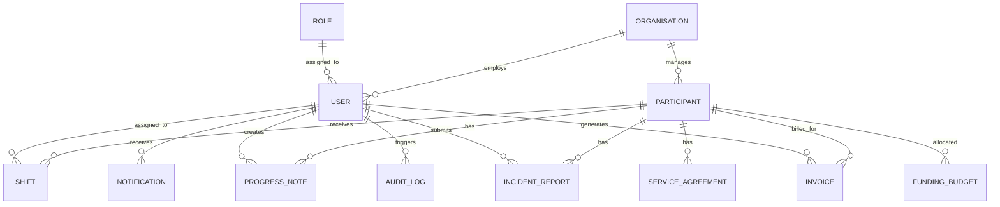
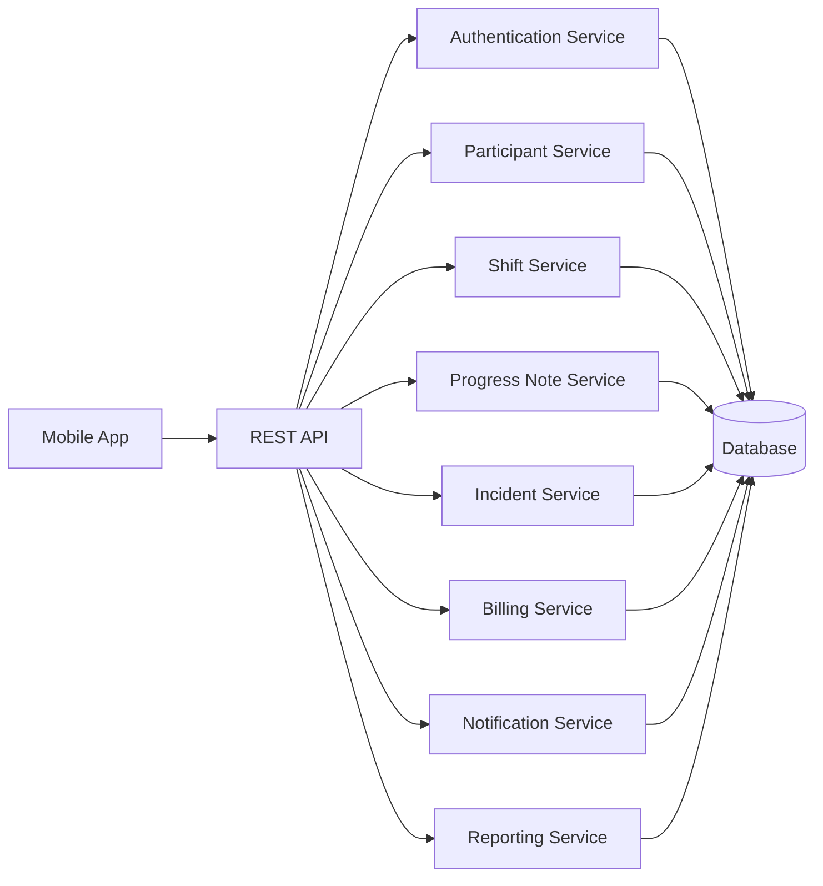
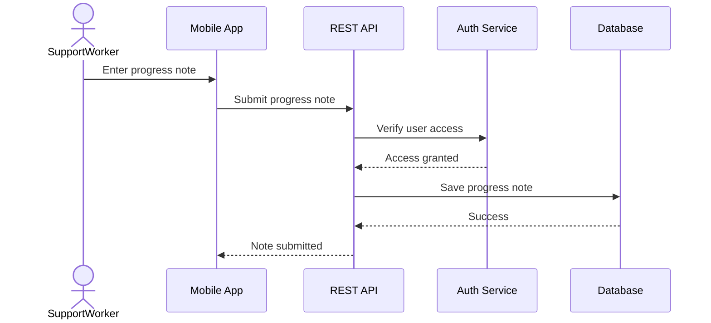

# Week 5 – Database Schema and API Specification

## Overview
This week focused on designing the **data model** and **REST API specification** for the **Sydney NDIS Provider Mobile App (GridLink NDIS)**. The aim was to define the main entities, their relationships, the required API endpoints, and key validation rules to support a secure and scalable system.

## Objective
To design a structured **database schema** and **API layer** that supports participant management, shift scheduling, progress notes, incident reporting, invoicing, notifications, and secure authentication.

## Activities
- Defined the main entities in the system  
- Identified relationships between entities  
- Designed the database schema  
- Defined REST API endpoints for core features  
- Specified important validation rules  
- Considered security and access control requirements  

## Key Questions
- What entities exist in the system?  
- What relationships exist between those entities?  
- What APIs are required to support the system functions?  

## Deliverable
**Database Schema and API Specification**

---

# Database Schema

## Main Entities
The main entities identified for the system are:

- Organisation  
- Role  
- User  
- Participant  
- Service Agreement  
- Shift  
- Progress Note  
- Incident Report  
- Invoice  
- Funding Budget  
- Notification  
- Audit Log  

## Relationship Summary
The main relationships in the system include:

- One organisation can have many users  
- One organisation can manage many participants  
- One role can be assigned to many users  
- One participant can have many shifts  
- One participant can have many progress notes  
- One participant can have many incident reports  
- One participant can have many invoices  
- One participant can have many funding budgets  
- One user can create many progress notes, incident reports, invoices, and audit logs  

## ER Diagram

---

# API Specification

## Main API Modules
The main API groups required for the system are:

- Authentication API  
- User Management API  
- Participant Management API  
- Shift Management API  
- Progress Note API  
- Incident Report API  
- Invoice API  
- Notification API  
- Reporting API  

## API Architecture Diagram

## Sample REST Endpoints

### Authentication
- `POST /api/auth/register`
- `POST /api/auth/login`
- `POST /api/auth/logout`
- `POST /api/auth/reset-password`

### Participants
- `GET /api/participants`
- `GET /api/participants/{id}`
- `POST /api/participants`
- `PUT /api/participants/{id}`
- `DELETE /api/participants/{id}`

### Shifts
- `GET /api/shifts`
- `POST /api/shifts`
- `PUT /api/shifts/{id}`
- `POST /api/shifts/{id}/check-in`
- `POST /api/shifts/{id}/check-out`

### Progress Notes
- `GET /api/progress-notes`
- `POST /api/progress-notes`
- `PUT /api/progress-notes/{id}`
- `DELETE /api/progress-notes/{id}`

### Incident Reports
- `GET /api/incidents`
- `POST /api/incidents`
- `PUT /api/incidents/{id}`

### Invoices
- `GET /api/invoices`
- `POST /api/invoices`
- `PUT /api/invoices/{id}`

### Notifications
- `GET /api/notifications`
- `PUT /api/notifications/{id}/read`

### Reports
- `GET /api/reports/operations`
- `GET /api/reports/budget`
- `GET /api/reports/incidents`
- `GET /api/reports/invoices`

---

# Validation Rules

The system should include the following validation rules:

- Required fields must not be empty  
- Email addresses must be in valid format  
- IDs must be unique and valid  
- Dates must be logical and correctly formatted  
- Numeric values must not be negative  
- Shift end time must be after shift start time  
- Check-out must not happen before check-in  
- Only authorised roles can access protected features  
- Incident evidence files must meet allowed file type and size rules  

---

# Example Workflow Diagram

## Progress Note Submission

---

# Summary
In Week 5, the main focus was on designing the **database schema** and **API specification** for the GridLink NDIS application. The core entities, relationships, REST endpoints, and validation rules were defined to support the main features of the system. The diagrams included in this section help clearly explain the backend structure and system workflow.
